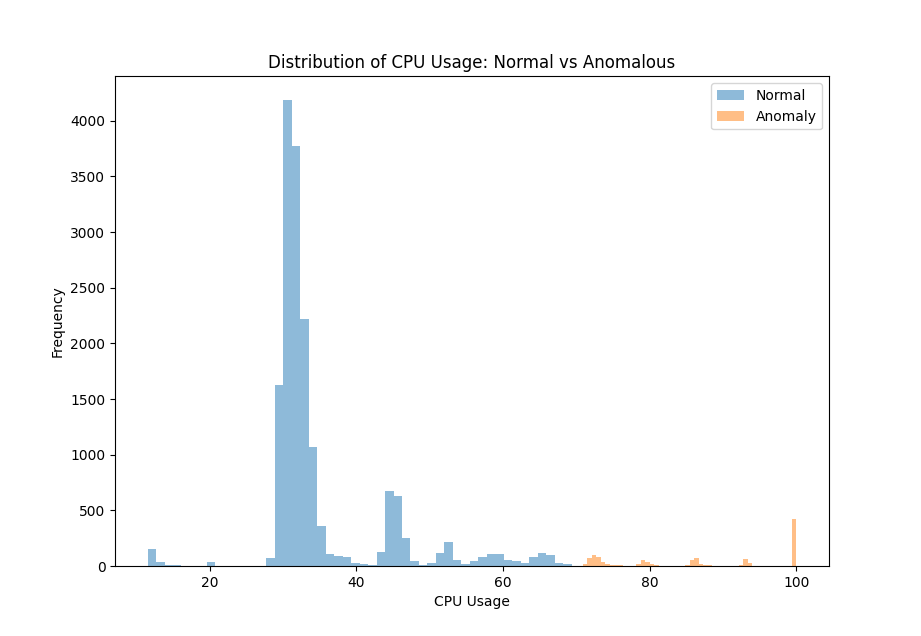
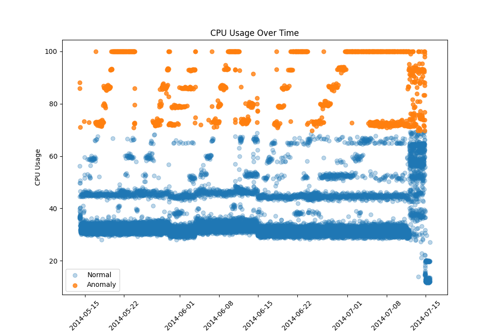
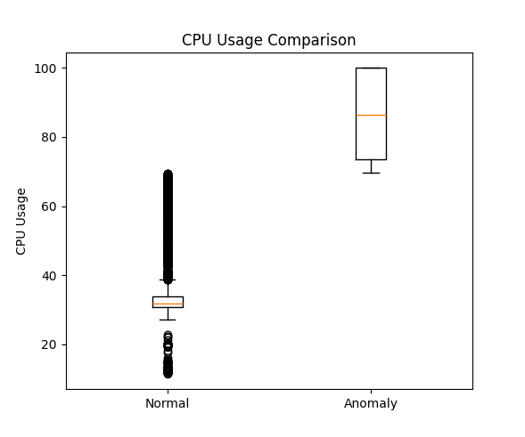

# CPU-Utilisation-Anomaly-Analysis
## Overview
This repository contains a quantitative analysis project, completed as part of my MSc Applied Computer Science (Research Methods module).

The project determines whether there is a significant statistical difference between anomalous and normal CPU utilisation patterns in an Amazon Web Services (AWS) environment using Python, statistical analysis techniques, and data visualisation.

## Research Question
> "Within a real-world time-series performance dataset, does anomalous behaviour differ significantly from normal behaviour?”

## Dataset
- Numenta Anomaly Benchmark (NAB)
- CPU Utilization Autoscaling Group (ASG) Misconfiguration
- 18,050 Observations

The dataset contains known anomalies caused by misconfigurations, making it suitable for evaluating anomaly detection methods.

## Technologies Used
- Python
- Pandas
- NumPy
- Matplotlib
- SciPy

## Methodology
The following quantitative methods were used throughout the analysis:

- Data preprocessing and validation
- Histogram visualisation
- Scatter plot analysis
- Box plot analysis
- Descriptive statistics
- Welch’s t-test

## Overall Statistical Summary

| Metric | Value |
|-------|------:|
| Sample Size | 18,050 |
| Mean | 38.28 |
| Median | 32.00 |
| Std. Dev | 15.64 |

A full statistical summary is available in:

- `statistics_summary.xlsx`

## Visualisations

<h3>Histogram</h3>

<h3>Scatter Plot</h3>

<h3>Box Plot</h3>

## Results
Welch’s t-test was used to evaluate the size of difference between the normal and anomalous groups. The resulting t-value is -154.82. The p-value is less than the significance level (p < 0.05), leading to the rejection of the null hypothesis (H₀).

The quantitative analysis provides evidence of a statistically significant difference between normal and anomalous CPU utilisation behaviour.

Key findings include:
- Successful identification of anomalous observations.
- Visualisation of outliers using multiple techniques.
- Application of statistical hypothesis testing.
- Demonstration of Python's capabilities for quantitative data analysis.
